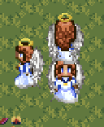
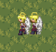
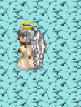
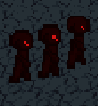
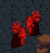
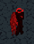

# Lore des Personnages

## 🪽 LES ANGES :

### **Les 3 archanges**

Dans les cieux du Paradis, trois archanges veillent : **Orin, Lyra, et Seren**. Armés du même arc sacré, ils tirent des flèches de lumière forgées dans le souffle divin. Leur mission est simple : protéger le Paradis des ombres qui rôdent aux frontières du monde céleste.
Lorsque leurs arcs se tendent à l’unisson, le ciel s’illumine, et même les ténèbres reculent. On dit que tant que leurs flèches brillent dans le vent, aucune obscurité ne pourra jamais atteindre le royaume des Cieux.

---

### **Les 2 chérubins**

Dans les cieux du Paradis, deux chérubins montent la garde : **Elior et Nara**. Ni les plus puissants, ni les plus sages, mais toujours là quand il faut. Ils veillent sur les jardins de lumière, tirant leurs flèches d’énergie pure quand l’ombre approche. Parfois maladroits, souvent bruyants, mais jamais absents.
Car même sans gloire ni couronne, les deux chérubins tiennent leur poste et c’est peut-être grâce à eux que le Paradis dort encore en paix.

---

### **Le séraphin**

Dans les hauteurs du Paradis, là où même la lumière s’incline, vit **Azeriel**, le Séraphin. Deux ailes seulement, mais une puissance que nul autre ne peut égaler. Ses flèches ne sont pas de lumière, mais de pure volonté, chaque tir efface le mal jusqu’à son souvenir. Silencieux, implacable, il veille seul sur les cieux.
On dit que quand le vent brûle d’une chaleur dorée, c’est Azeriel qui s’éveille… le plus fort des anges, et le dernier rempart du Paradis.

---

## 😈 LES DÉMONS

### **Les 3 diablotins**

Des profondeurs brûlantes de l’Enfer sont sortis trois petits diablotins : **Grim, Tork, et Vex**. Minuscules, mais terriblement agités, ils ne rêvent que d’une chose : voir le Paradis en flammes. Leurs rires résonnent dans les cendres tandis qu’ils lancent leurs boules de feu vers les nuages sacrés. Chaque explosion laisse derrière elle une trace rouge dans le ciel, un défi aux anges eux-mêmes.
On dit que là où le tonnerre gronde sans pluie, ce ne sont pas les éclairs du ciel… mais les trois diablotins qui s’amusent à brûler les portes du Paradis.

---

### **Les 2 anges déchus**

Autrefois lumineux, maintenant ternis, **Kael et Liora** errent entre le ciel et l’ombre. Ni puissants, ni redoutables, ils cherchent encore leur place dans un monde qui les a rejetés. Leurs ailes ébréchées peinent à les porter, et leurs sorts manquent souvent de force. Pourtant, malgré leurs maladresses et leur orgueil égratigné, ils continuent d’essayer…
Car même moyens, les deux anges déchus restent une menace pour ceux qui sous-estiment le pouvoir d’un cœur brisé.

---

### **Le démon**

Dans les ténèbres profondes de l’Enfer réside **Azrath**, un démon seul mais terriblement puissant. Ses yeux rouges percent l’obscurité, et sa simple présence fait frissonner la chair des anges. Sans alliés, il avance comme une tempête, ses griffes et sa boule de feu dévastant tout sur son passage. Il ne rit pas, il ne parle pas, il détruit.
On dit que quand les nuages s’assombrissent sans vent, Azrath est là… un démon unique, dont la force seule peut faire vaciller le Paradis.
